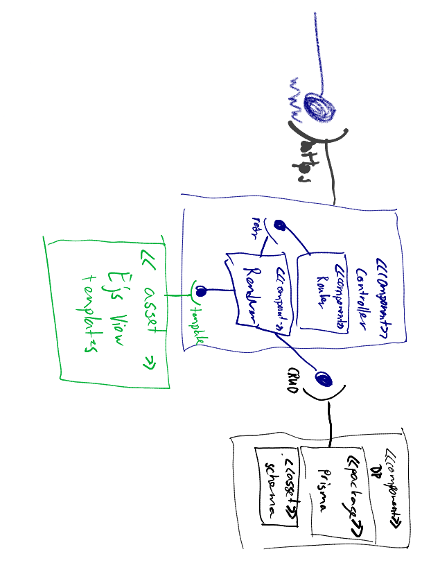

# [PI-Planning-Kapazitaetsplaner](https://kapazitaetsplaner.atlassian.net/)

# Inhaltsverzeichnis

- [PI-Planning-Kapazitaetsplaner](#pi-planning-kapazitaetsplaner)
- [Inhaltsverzeichnis](#inhaltsverzeichnis)
- [Management Summary](#management-summary)
  - [Hintergrund](#hintergrund)
  - [Ziele und Rahmenbedingungen](#ziele-und-rahmenbedingungen)
  - [Nächste Schritte](#nächste-schritte)
- [Einleitung](#einleitung)
- [Umgesetzte Anforderungen](#umgesetzte-anforderungen)
- [UML Komponentendiagramm](#uml-komponentendiagramm)
- [Datenmodell](#datenmodell)
- [Reflexion](#reflexion)
# Management Summary
## Hintergrund
Im Rahmen des Basislehrjahrs im 4. Semester der Applikationsentwickler-Ausbildung, bekamen wir den Auftrag während einem Semester ein Projekt umzusetzen. Nach einem Meeting mit unseren Berufsbildnern haben wir uns dazu entschieden einen Kapazitätsplaner zu entwickeln. Unser Entscheid fiel auf dieses Projekt, da die Kapazitätsplanung aktuell mit Excel gemacht wird und es dazu noch keine andere Möglichkeit gibt.

## Ziele und Rahmenbedingungen
Unser Ziel ist es, dass die Applikation von den Teams für deren Kapazitätsplanung verwendet werden kann. Dabei soll auf keine Keyfeatures des Excels verzichtet werden sollen.

Während einem Semester sollten folgende Features umgesetzt werden:
- Kalennder zum Eintragen der Abwesenheiten
- Tabelle zum Anzeigen der Velocity und eintragen der umgesetzten Storypoints
- Einstellungen zum sich einem Team zuzuweisen, seine Arbeitszeiten einzutragen und das Erscheinungsbild der Applikation zu verändern.
- Sprintverwaltung um die Sprints und Planungstage eines PIs zu definieren
- Feiertageverwaltung um die Feiertage eines Jahres einzutragen
- Login, welches kompatibel mit dem Loginsystem der Suva ist

Zusätliche features währen:
- Einsehen in fremde Kalender
- Einsehen in fremde Teamkalender

## Nächste Schritte
Die weiteren Schritte währen: Dass ganze Projekt in der Suva zu deployen und die Applikation im grösseren Rahmen zu testen. Dazu fallen (hoffentlich möglichst wenige) Bugs an, welche gefixt werden müssen. Dies wird aber in der Rösslimatt gemacht und nicht mehr im Basislehrjahr in Adligenswil.

# Einleitung
Für die Realisierung des Kapazitätsplaner haben wir uns ein Scrumboard aufgesetzt, welches wir zu Beginn des Semesters mit den ersten Features befüllt haben. Zudem haben wir auch die Sprints geplant und Einladungen für die jeweiligen Reviews verschickt.

Während der Umsetzungsphase mussten wir viele Entscheidungen treffen bezüglich den umzusetzenden Features. Dies haben wir meistens in den Reviews mit den Praxisbildner getan. Dabei kam zustande, dass wir z.B. das Feature: die Kalender der Teammitglieder sehen, nicht umgesetzt haben. Während des Entscheidungsprozesses wurde schnell Einigkeit erzeugt. Die zusammenarbeit mit den Praxisbildner, sowie unter den Entwicklern verlief durch das Projekt durch hervorragend. Dies war ein entscheidender Faktor dafür, wie schnell wir voran gekommen sind. Ein weiterer Faktor dafür war der Arbeitsort. Wir hatten stehts die Möglichkeit im Homeoffice oder vor Ort zu arbeiten, wie es uns am besten passt. Somit kamen wir am Arbeiten an den individuellen Arbeitsplätzen sehr schnell voran und konnten uns dann für Pairprogramming Sessions vor Ort treffen. Die Dailys hielten wir oft über Remote. Diese Faktoren halfen uns dabei das Projekt gegen Ende des Semesters fertigzustellen.

# Umgesetzte Anforderungen
Wir konnten während dem Semester alle grundlegenden Anforderungen umsetzen. Diese währen:
- Kalennder zum Eintragen der Abwesenheiten
- Tabelle zum Anzeigen der Velocity und eintragen der umgesetzten Storypoints
- Einstellungen zum sich einem Team zuzuweisen, seine Arbeitszeiten einzutragen und das Erscheinungsbild der Applikation zu verändern.
- Sprintverwaltung um die Sprints und Planungstage eines PIs zu definieren
- Feiertageverwaltung um die Feiertage eines Jahres einzutragen
- Login, welches kompatibel mit dem Loginsystem der Suva ist

Die zusätzlichen Anforderungen wurden nicht umgesetzt, da wir es nicht für nötig gehalten haben diese zu realisieren. Diese Entschiedung wurde mit dem Praxibildnern gefällt.

# UML Komponentendiagramm

# Datenmodell

Erstellt mit <a href="https://prisma-erd.simonknott.de/">Prisma ERD generator</a>
# Reflexion